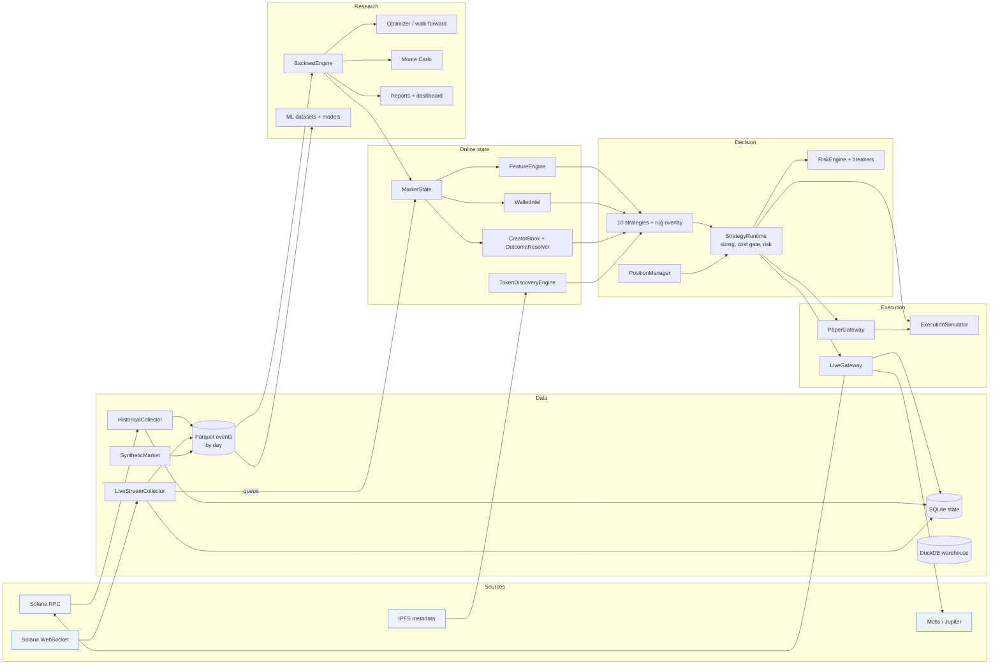

# Architecture

## Design principles

1. **One code path for research and trading.** Market state, features, wallet intelligence,
   creator scoring, strategies, sizing, risk and position management are the same objects in
   the backtester, in paper trading and in live trading. Only the execution gateway differs.
2. **Point-in-time everything.** Every component is updated online, event by event, and can only
   see what has already happened. Labels and outcomes resolve after their horizon.
3. **Exact protocol math.** Quotes and fills use integer arithmetic that matches the on-chain
   programs (bonding curve and PumpSwap), including every fee component.
4. **Nothing hidden.** Every parameter is in the YAML config, every secret in `.env`, every run
   carries a config fingerprint and a data fingerprint.

## Component map



## The event model

Everything downstream of the collectors consumes one flat record type, `core.types.Event`, with
the 32-column schema in `EVENT_SCHEMA` (see [DATA_MODEL.md](DATA_MODEL.md)). Events are
produced from:

* **Program logs** (`Program data:` lines) attributed to the correct program with an invoke-stack
  parser. Logs can be truncated by the runtime; truncation is detected, the gap is registered, and
  the transaction is queued for an RPC re-fetch.
* **Self-CPI event instructions** (`emit_cpi!`, tag `e445a52e51cb9a1d`) in fetched transactions,
  which are immune to log truncation; the historical collector prefers them.

Decoding is IDL-driven (`core/idl.py`, Anchor ≥ 0.30 layouts with 8-byte discriminators) and
tolerant of older, shorter layouts, so years of history decode with one codec. PumpSwap events
report pre-trade reserves; the decoder converts them to post-trade reserves so every event carries
the state *after* the trade.

Ordering is total: `(slot, seq, ev_idx)`. `seq` is the transaction's position within the slot
(from the block, or the arrival order on the live stream), `ev_idx` the event's position within
the transaction.

## Online state

| Object | Holds | Updated by |
|---|---|---|
| `MarketState` | `TokenState` per mint: curve / pool reserves, price, ATH, drawdowns (price and liquidity), creator buys / sells, creation-slot buyers, venue | every event |
| `FeatureEngine` | per-token rolling windows (short / medium / long), EWMAs, bars, holder balances | every trade |
| `WalletIntel` | per-wallet round trips, realised PnL, posterior smart score, labels, insider clusters | creates, trades, resolved outcomes |
| `CreatorBook` | per-creator launches and resolved outcomes (Beta posteriors, Wilson bounds) | `OutcomeResolver` at each token's horizon |
| `TokenDiscoveryEngine` | discovered tokens with metadata, socials, sector, anomalies | creates (+ async IPFS enrichment live) |

`FeatureView` is a lazy accessor: features are computed on demand for the token being
evaluated, at the evaluation time, after evicting window contents older than the window.

## Decision flow

For every event (and every `sweep_interval_ms` for tokens with open positions):

1. `StrategyRuntime.evaluate` builds a `StrategyContext` (features, position, pending order,
   wallet intel, lazily computed creator score and rug probability).
2. With a position: the rug-avoidance overlay, the `PositionManager` (stop, take-profit ladder,
   trailing stop, breakeven, max hold, scale-in) and the owning strategy each may propose an
   action; the highest-priority, highest-confidence one wins.
3. Without a position: every strategy's `generate_signal`; the best BUY goes through minimum
   confidence, the re-entry cooldown, the overlay veto, sizing (with a price-impact cap), the
   cost gate (expected return ≥ `cost_gate_multiple` × round-trip cost), and the risk engine.
4. The order goes to the gateway. One order per token is in flight at a time.
5. The result (fill or failure) comes back through `on_result`, which may create a retry
   (wider slippage, higher priority fee) according to `simulation.retries`.

## Concurrency (live)

```
WebSocket reader ──> LiveStreamCollector ──┬──> asyncio.Queue ──> LiveTrader.on_event (single task: state + decisions)
                                           ├──> Parquet flush loop (every flush_interval_s)
                                           └──> repair loop (re-fetch truncated / failed txs)
LiveTrader ──> order priority queue ──> N worker tasks ──> gateway.execute (quote → build → sign → send → confirm)
           ──> sweep loop (positions without new events)      BlockhashCache / PriorityFeeEstimator refresh tasks
           ──> snapshot loop (state → SQLite → dashboard Live monitor)
```

All state lives on one event-loop thread, and every mutation (handling an event, booking a fill)
is synchronous code between two `await`s, so strategies and risk never see a half-applied
update. Network I/O is awaited on the worker tasks. Exits have priority over entries in the
order queue.

Time goes through a clock object (`core/clock.py`): the wall clock when trading, a
`ReplayClock` on a `VirtualTimeEventLoop` for `paper-replay`. On the virtual-time loop the clock
jumps to the next timer whenever every task is waiting, so recorded events run through this exact
concurrency structure deterministically and far faster than real time, with every latency and
retry measured in market time.

## Performance

* Event replay: ~20–26k events/s per core in the backtester with full state, features and
  strategy evaluation (measured on the synthetic market; see the report footer of any run).
* Hot numeric paths (drawdown statistics, Monte Carlo) are Numba-compiled with a pure-Python
  fallback (`PUMPFUN_DISABLE_NUMBA=1`).
* Optimisation and path-level Monte Carlo fan out over a process pool.
* Storage is columnar (Parquet, zstd) with predicate pushdown through Polars / DuckDB scans.

## Where to extend

| To add | Implement | Register |
|---|---|---|
| A strategy | subclass `strategies.base.Strategy` with a `Params` model and `generate_signal` | `@register`, then params in `strategy.params` |
| A feature | a property on `FeatureView` (+ vectorised version in `features/batch.py`) | `features/registry.py` |
| A venue | quote / fill math in `core/` + the simulator branches + an event decoder | `Venue` enum |
| An execution route | a gateway implementing `execute(order) -> Fill` | `main._run_trader` gateway factory |
